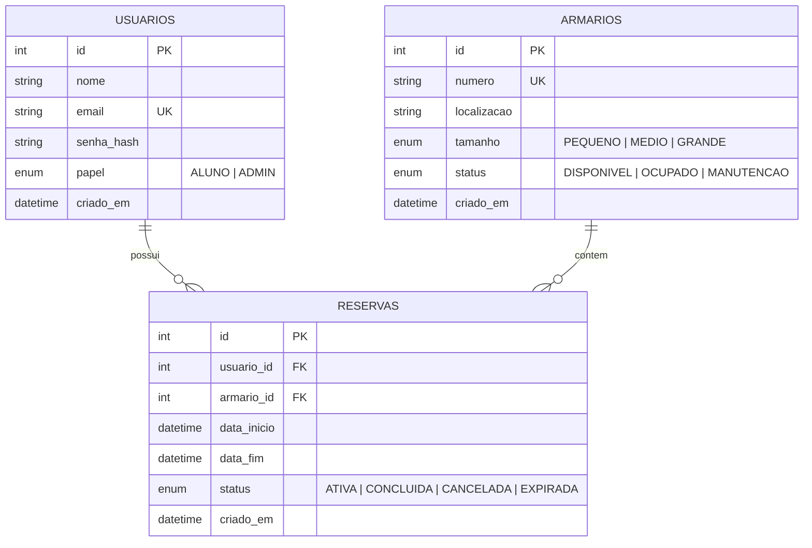

# Diagrama de Entidade-Relacionamento (DER) - Locky

## 1. Visão Geral
O sistema **Locky** gerencia reservas de armários em academias e ambientes corporativos. Seu modelo de dados é composto por três entidades principais: **Usuário**, **Armário** e **Reserva**.

---

## 2. Diagrama Entidade-Relacionamento (Mermaid)

---

## 3. Dicionário de Dados

### 3.1. Tabela `usuarios`
Armazena as informações dos alunos e administradores do sistema.

| Coluna | Tipo de Dado | Restrições | Descrição |
| :--- | :--- | :--- | :--- |
| `id` | Integer | PK, Auto Increment | Identificador único do usuário. |
| `nome` | String(100) | Not Null | Nome completo do usuário. |
| `email` | String(150) | Not Null, Unique, Index | Endereço de e-mail (usado no login). |
| `senha_hash` | String(255) | Not Null | Hash da senha gerado com Bcrypt. |
| `papel` | Enum (`PapelUsuario`) | Not Null, Default `ALUNO` | Nível de acesso: `ALUNO` ou `ADMIN`. |
| `criado_em` | DateTime | Not Null, Default `UTC NOW` | Timestamp de criação da conta. |

---

### 3.2. Tabela `armarios`
Armazena os armários físicos disponíveis no estabelecimento.

| Coluna | Tipo de Dado | Restrições | Descrição |
| :--- | :--- | :--- | :--- |
| `id` | Integer | PK, Auto Increment | Identificador único do armário. |
| `numero` | String(20) | Not Null, Unique, Index | Número ou identificador visível do armário (ex: `A-101`). |
| `localizacao` | String(100) | Not Null | Bloco, andar ou setor onde se encontra (ex: `Bloco B - Vestiário Masculino`). |
| `tamanho` | Enum (`TamanhoArmario`) | Not Null | Porte do armário: `PEQUENO`, `MEDIO`, `GRANDE`. |
| `status` | Enum (`StatusArmario`) | Not Null, Default `DISPONIVEL` | Estado do armário: `DISPONIVEL`, `OCUPADO`, `MANUTENCAO`. |
| `criado_em` | DateTime | Not Null, Default `UTC NOW` | Timestamp de cadastro do armário. |

---

### 3.3. Tabela `reservas`
Registra os empréstimos e alocações de armários para os usuários.

| Coluna | Tipo de Dado | Restrições | Descrição |
| :--- | :--- | :--- | :--- |
| `id` | Integer | PK, Auto Increment | Identificador único da reserva. |
| `usuario_id` | Integer | FK (`usuarios.id`), Index | ID do usuário responsável pela reserva. |
| `armario_id` | Integer | FK (`armarios.id`), Index | ID do armário reservado. |
| `data_inicio` | DateTime | Not Null | Data e hora em que a reserva entra em vigor. |
| `data_fim` | DateTime | Not Null | Data e hora limite de expiração da reserva. |
| `status` | Enum (`StatusReserva`) | Not Null, Default `ATIVA` | Situação da reserva: `ATIVA`, `CONCLUIDA`, `CANCELADA`, `EXPIRADA`. |
| `criado_em` | DateTime | Not Null, Default `UTC NOW` | Timestamp de criação da reserva. |

---

## 4. Regras de Integridade e Regras de Negócio

1. **Unicidade de Reserva Ativa por Usuário**: Cada usuário pode ter no máximo **uma** reserva com status `ATIVA` simultaneamente.
2. **Exclusividade de Armário**: Um armário com status `OCUPADO` não pode receber novas reservas até ser liberado (`CONCLUIDA`, `CANCELADA` ou `EXPIRADA`).
3. **Expiração Automática**: Reservas ativas cujo `data_fim` seja anterior ao horário atual têm seu status atualizado automaticamente para `EXPIRADA`, liberando o armário para `DISPONIVEL`.
